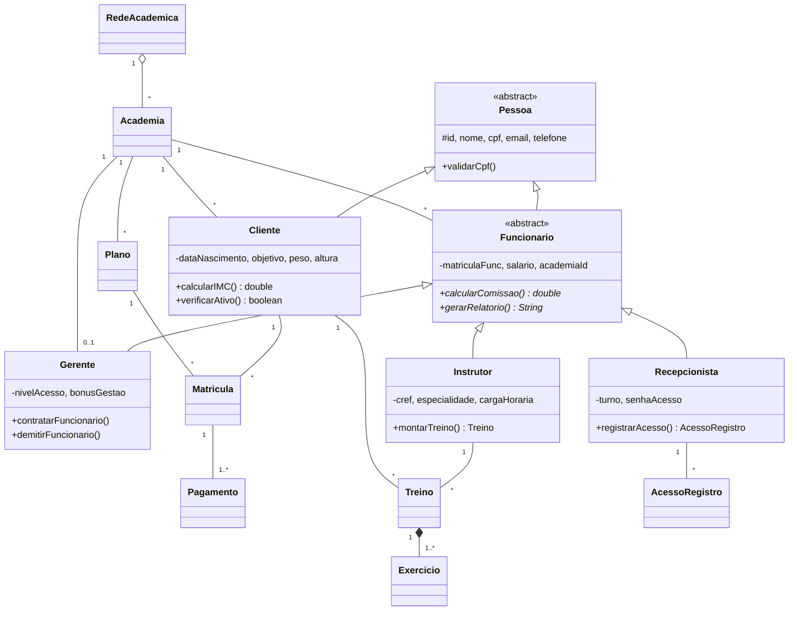

# Sistema de Gerenciamento de Rede de Academias

Aplicação Java de terminal que gerencia uma **rede de academias fitness**, desenvolvida
para a **Atividade Unidade 03 — Programação Orientada a Objetos** (Prof. Jefferson Gomes Dutra).

O sistema demonstra os principais conceitos de POO: **herança**, **polimorfismo de regras
de negócio**, **encapsulamento**, **máquinas de estado**, **exceções personalizadas** e
**persistência em arquivos JSON** (implementada sem bibliotecas externas).

---

## Como executar

> **Pré-requisito:** JDK **17 ou superior** instalado (o projeto usa recursos como
> *switch expressions* e *pattern matching*). Desenvolvido e testado com o **JDK 22**.

### Pelo terminal (Windows / PowerShell)

```powershell
# a partir da raiz do projeto
$arquivos = (Get-ChildItem -Recurse -Filter *.java -Path br).FullName + "Main.java"
javac -d out $arquivos
java -cp out Main
```

### Pelo terminal (Linux / macOS / Git Bash)

```bash
javac -d out $(find br -name "*.java") Main.java
java -cp out Main
```

### Pelo IntelliJ IDEA

1. Abra a pasta do projeto (`File > Open`).
2. Garanta que o **Project SDK** está em **17+** (`File > Project Structure > Project`).
3. Execute a classe **`Main`** (botão ▶ ou `Shift+F10`).

> Na **primeira execução** o sistema gera **dados de exemplo** automaticamente. Ao encerrar
> (opção `0` ou `Ctrl+C`), todo o estado é salvo na pasta `data/` (criada automaticamente).
> Nas execuções seguintes os dados são carregados desses arquivos.

---

## Estrutura do projeto

```
br/com/redeacademia/
├── model/            RedeAcademica, Academia, Plano, Matricula, Pagamento, Treino, Exercicio, AcessoRegistro
│   ├── pessoa/       Pessoa (abstract), Cliente, Funcionario (abstract), Gerente, Instrutor, Recepcionista
│   └── enums/        StatusMatricula, StatusPagamento, NivelTreino, TipoAcesso, TurnoFuncionario, NivelAcesso
├── exception/        AcademiaException (base) + 10 exceções específicas
├── repository/       Um repositório por entidade (CRUD em memória + leitura/escrita JSON)
├── service/          Regras de negócio, autorização, folha de pagamento e relatórios
├── ui/               Menus interativos de terminal
└── util/             Json (parser/serializer próprio), ValidadorCpf, GeradorId, MapUtil
Main.java             Ponto de entrada (carga, seed, RN07, shutdown hook, menu)
docs/diagrama-classes.puml   Diagrama de classes (PlantUML)
data/                 Arquivos de texto (.txt, conteúdo em JSON) gerados em runtime
```

---

## Diagrama de Classes (resumido)



> O diagrama completo (com atributos, métodos, enums e hierarquia de exceções) está em
> [`docs/diagrama-classes.puml`](docs/diagrama-classes.puml) — cole o conteúdo em
> [planttext.com](https://www.planttext.com) ou use a extensão *PlantUML* para renderizar.

---

## Atendimento aos requisitos da atividade

| Requisito | Como é atendido |
|---|---|
| **≥ 11 classes** (sem contar enums) | 14 classes de domínio + 11 exceções + repositórios/serviços |
| **Encapsulamento** | Todos os atributos `private`/`protected`, acesso por getters/setters validados |
| **Polimorfismo** (2 hierarquias) | `calcularComissao()` e `gerarRelatorio()` — 3 implementações cada (Gerente/Instrutor/Recepcionista) |
| **≥ 5 regras de negócio** | RN01 a RN07 (7 regras), ver tabela abaixo |
| **Interação entre múltiplas classes** | Criação de matrícula liga Cliente → Plano → Academia → Pagamento |
| **Exceções personalizadas + validação** | `AcademiaException` (base) + 10 subclasses; validação de dados nos setters |
| **Diagrama de classes (UML)** | `docs/diagrama-classes.puml` + Mermaid acima (classes, relações, multiplicidades) |
| **Persistência em arquivos** | `repository/` grava/lê JSON com `FileWriter`/`BufferedWriter` e `FileReader`/`BufferedReader` (try-with-resources, `IOException`); carga na inicialização + *shutdown hook* |
| **≥ 1 classe com estado dinâmico** | `Matricula` e `Pagamento` (máquinas de estado com transições validadas) |
| **Interação via terminal** | `ui/` com menus interativos |

### Polimorfismo (comportamento de negócio)

| Método | Gerente | Instrutor | Recepcionista |
|---|---|---|---|
| `calcularComissao()` | salário + bônus de gestão + bônus por funcionário ativo | salário + 5% sobre os planos dos alunos acompanhados | salário + adicional fixo + adicional noturno |
| `gerarRelatorio()` | receita, inadimplentes, ocupação | alunos, treinos, carga média | log de acessos e horário de pico |

A folha de pagamento itera `List<Funcionario>` chamando `calcularComissao()` e o módulo de
relatórios chama `gerarRelatorio()` — **sem conhecer o tipo concreto**.

### Regras de negócio

| # | Regra | Exceção |
|---|---|---|
| RN01 | CPF único e válido (dígitos verificadores) | `CpfInvalidoException` / `CpfDuplicadoException` |
| RN02 | Cliente só contrata plano da própria academia | `PlanoDeOutraAcademiaException` |
| RN03 | Cada academia tem no máximo 1 gerente | `GerenteJaAtribuidoException` |
| RN04 | Só o gerente da unidade contrata/demite | `AcessoNegadoException` |
| RN05 | Matrícula só ativa com pagamento confirmado | `MatriculaSemPagamentoException` |
| RN06 | Inadimplente não acessa nem recebe treino | `ClienteInadimplenteException` |
| RN07 | Vencimentos automáticos na inicialização | (transições automáticas de estado) |

### Máquinas de estado

- **Matricula:** `ATIVA · SUSPENSA · CANCELADA · VENCIDA`
- **Pagamento:** `PENDENTE · PAGO · ATRASADO · CANCELADO`

Cada uma valida as transições em `avancarEstado(...)`, lançando
`TransicaoEstadoInvalidaException` para transições proibidas (ex.: `CANCELADA → ATIVA`).

---

## Dados de exemplo

Na primeira execução são criados: 1 rede, 2 academias, 4 funcionários (gerentes, instrutor,
recepcionista), 4 clientes, 3 planos, matrículas + pagamentos e um treino com exercícios —
suficiente para demonstrar relatórios, folha de pagamento e todas as regras de negócio.

---

## Autores

Grupo da disciplina de POO — ver `ENTREGA.txt`.
